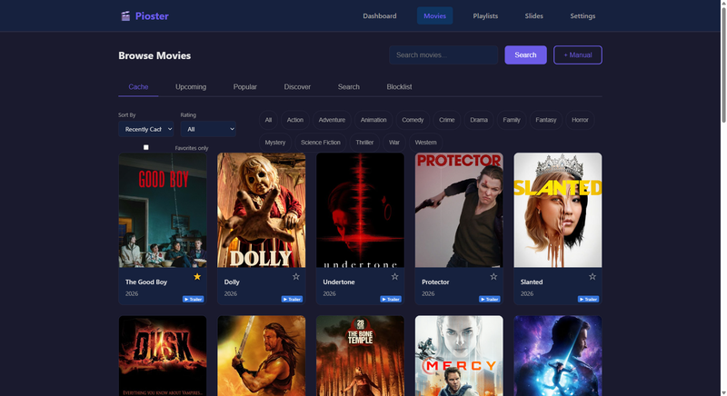

<p align="center">
  
</p>

<h1 align="center">htMarquee</h1>
<p align="center">
  <strong>Smart movie poster display for home theater lobbies</strong><br>
  Turn any 4K TV into a gorgeous, automated movie poster slideshow powered by a Raspberry Pi 5.
</p>

<p align="center">
  <a href="https://htmarquee.com">Website</a> &bull;
  <a href="https://community.htmarquee.com">Community</a> &bull;
  <a href="https://github.com/htMarquee/htMarquee_app/releases/latest">Download</a>
</p>

---

## What is htMarquee?

htMarquee transforms a Raspberry Pi 5 and a 4K TV into a theater-quality movie poster display. It automatically cycles through movie posters with trailers, syncs with your Plex or Jellyfin server during playback, and provides a web-based control panel accessible from any device.

<p align="center">
  
</p>

### Key Features

- **Automated poster slideshow** with smooth GPU-accelerated transitions
- **Trailer playback** between poster reveals
- **Plex & Jellyfin integration** — auto-switches to "Now Playing" during playback
- **Web control panel** — manage everything from your phone or desktop
- **TMDB-powered** — automatic poster, backdrop, trailer, and metadata fetching
- **Customizable banner** — text, font, size, color, or custom image
- **LED strip sync** (WS2812B/SK6812) — ambient lighting that matches the display
- **HDMI-CEC** — auto power on/off your TV on schedule
- **Custom slides** — insert your own images/videos between movies
- **OTA updates** — one-click updates from the app

<p align="center">
  
</p>

## Tiers

htMarquee comes in two tiers:

### Matinee (Free)

Everything you need to get started:

- Poster slideshow with fade transitions
- Up to 50 movies and 3 playlists
- Playlist scheduler
- Custom banner text and images
- Format badge icons (Dolby Atmos, DTS:X, etc.)
- Info row customization
- Backup & restore
- Manual mode

### Premiere (Paid)

Unlock the full experience:

- **Unlimited** movies and playlists
- **Trailer playback** with pre/post poster timing
- **Animated posters** (MP4/WebM loops)
- **All transitions** — crossfade, slide, zoom, wipe, 3D flip, and more
- **Multiple posters** per movie with auto-rotation
- **Plex & Jellyfin sync** — live "Now Playing" mode
- **HDMI-CEC TV control** with scheduled on/off
- **LED strip sync** — WS2812B, SK6812, and more via SPI
- **Custom slides** — interstitial images and videos
- **Home Assistant integration**
- **REST API** for advanced automation
- **OTA updates** — stay current with one click
- **Priority support**

## Hardware Requirements

- Raspberry Pi 5 (4GB+ RAM)
- 16GB+ microSD card (U3 speed class, 32GB recommended)
- Micro-HDMI to HDMI cable
- 4K TV (60Hz recommended)

## Quick Install

```bash
curl -sSL https://htmarquee.com/install.sh | sudo bash
```

Run on a fresh **Raspberry Pi OS Lite (64-bit)** installation. The setup wizard at `http://htmarquee.local` guides you through configuration.

You'll need a free [TMDB API key](https://www.themoviedb.org/settings/api) (takes 2 minutes to sign up).

## API Keys

| Service | Required | Provides |
|---------|----------|----------|
| [TMDB](https://www.themoviedb.org/settings/api) | **Yes** (free) | Posters, backdrops, trailers, metadata |
| [OMDb](https://www.omdbapi.com/apikey.aspx) | Optional (free) | Rotten Tomatoes & Metacritic scores |

## Updates

htMarquee checks for updates automatically (Premiere tier) or manually via the web dashboard. Updates are downloaded, verified (SHA-256 + Ed25519 signature), and installed with a single click. Rollback to the previous version is always available.

## Community

- [Website](https://htmarquee.com)
- [Community Forum](https://community.htmarquee.com)
- [Report an Issue](https://github.com/htMarquee/htMarquee_app/issues)

## License

htMarquee is proprietary software. See [htmarquee.com](https://htmarquee.com) for pricing and terms.
